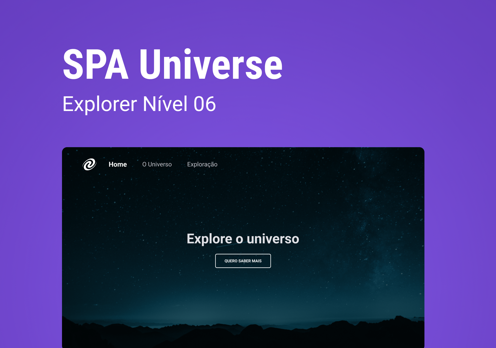

   

<!--  -->

<h2 align="center">Tecnologias 🚀</h2>

 <!-- -->
    
  

Esse projeto foi desenvolvido com as seguintes tecnologias:

- **HTML**
- **CSS**
- **Javascript**

  <!-- -->
    

  O que será abordado nesse desafio:

 

  
 Conceitos de SPA

  
 Mapeamento de rotas

  
 Assíncrono e promises 

  
rientação a objetos

  
 Modularização

  
  ---
  <h3 align="center">Projeto💻 </h3>
  
Acesse o projeto em <a href="https://micaela-marques.github.io/CalculateIMC/"> site🌐
  

